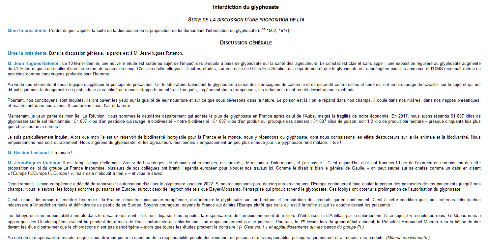
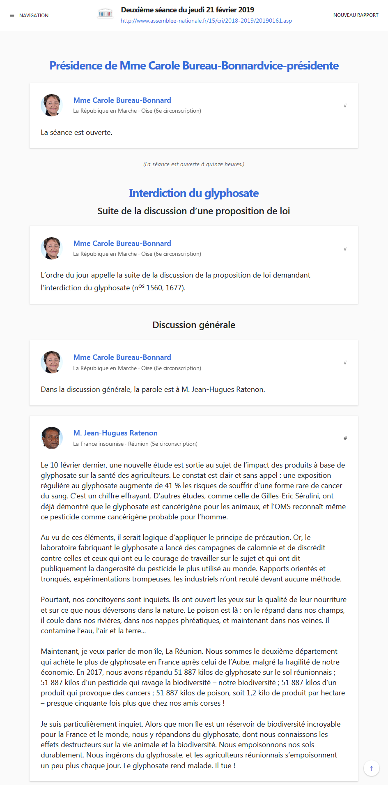

Compte Rendu de l'Assemblée Nationale ✨
===

Récemment, je me suis retrouvé à lire un compte rendu sur le site de l'assemblée nationale. J'ai trouvé la mise en page peu adaptée au contenu et le manque d'informations sur les participants fort dommage.

Comme ça faisait un moment que je voulais testé le langage **Go** et la librairie [iris](https://github.com/kataras/iris), je me suis dis que ça ferait un bon petit TP !

Et voici le résultat avec à gauche la version originale et à droite la version sortie par cet outil :

<div align="center">
  </img>
  </img>
</div>

*Une démo est hébergée sur [heroku](https://powerful-scrubland-26285.herokuapp.com/), c'est un peu lent étant donné qu'il s'agit d'un compte gratuit mais il suffit d'être patient.*

## Récupération et lancement

Il vous faudra une version de **Go** d'installée sur votre machine (1.11 ou ultérieur).

La commande `go run` ci-dessous ira chercher les dépendances nécessaires au projet puis lancera le serveur web.

```bash
$ git clone https://github.com/YuukanOO/cran.git
$ cd cran
$ go run main.go
```

## Problèmes connus

Il reste quelques imperfections ici et là selon les comptes rendus, n'hésitez pas à contribuer si le coeur vous en dit !